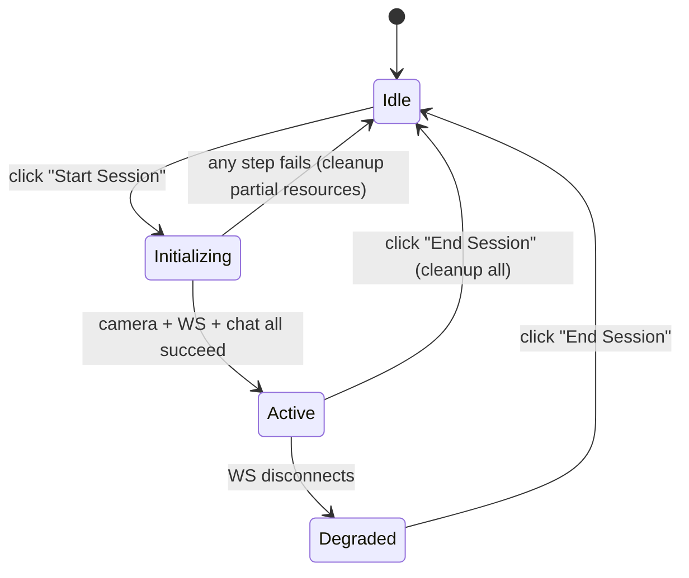

# Design Document: Live Vision & Voice Triage Room

## Overview

The Live Triage Room is a real-time product inspection system that combines three independently deployable services into a unified user experience:

1. **Vision_Service** — A Python FastAPI WebSocket endpoint (`/vision-stream`) that receives Base64 JPEG frames, runs YOLOv8 inference, and returns defect bounding-box JSON.
2. **Backend_Gateway** — A Node.js/Express REST endpoint (`POST /api/triage/chat`) that proxies conversation turns to Google Gemini, configured as an Amazon Returns Triage Agent.
3. **Triage_Room_UI** — A React component that orchestrates the webcam feed, canvas overlay for bounding boxes, chat panel with TTS, and session lifecycle.

The design prioritizes low-latency feedback (sub-200ms frame processing), graceful degradation (chat works even if vision fails), and simplicity (WebSocket frame streaming rather than full WebRTC).

## Architecture

```mermaid
flowchart TB
    subgraph Browser["Browser (localhost:3000)"]
        UI[Triage_Room_UI<br/>React Component]
        Video[HTMLVideoElement<br/>Webcam Feed]
        Canvas[HTMLCanvasElement<br/>Bounding Box Overlay]
        Chat[Chat Panel<br/>+ TTS]
    end

    subgraph MLService["ml-service (localhost:8000)"]
        WS_Endpoint["/vision-stream"<br/>WebSocket Endpoint]
        YOLO[YOLOv8 Inference<br/>Frame Processor]
    end

    subgraph BackendGW["Next.js API Route (localhost:3000)"]
        ChatRoute["POST /api/triage/chat"<br/>Express Handler"]
        Gemini[Google Gemini API<br/>Triage Agent]
    end

    UI -->|getUserMedia| Video
    Video -->|capture @ 10fps<br/>Base64 JPEG q=0.7| WS_Endpoint
    WS_Endpoint --> YOLO
    YOLO -->|Defect_Detection_Payload JSON| UI
    UI -->|render boxes| Canvas
    UI -->|POST conversation| ChatRoute
    ChatRoute -->|forward with system prompt| Gemini
    Gemini -->|AI response| ChatRoute
    ChatRoute -->|response JSON| Chat
    Chat -->|speechSynthesis| UI
```

**Key architectural decisions:**

| Decision | Rationale |
|----------|-----------|
| WebSocket for vision, REST for chat | Frames need persistent low-latency streaming; chat is request-response and benefits from HTTP semantics (retries, status codes). |
| Vision endpoint on existing ml-service (port 8000) | Avoids a new service; the existing FastAPI app already has CORS configured for localhost:3000. |
| Chat endpoint as Next.js API route | Keeps the Gemini API key server-side, leverages existing Next.js API route patterns, zero additional infrastructure. |
| Canvas overlay (not SVG/DOM) | Canvas clears and redraws in a single frame; ideal for 10fps bounding box updates without DOM thrashing. |
| No automatic WebSocket reconnection | Simplifies state management; user controls session lifecycle explicitly. |
| Frame-skip strategy on server | If inference is slower than frame arrival, server processes only the latest frame — prevents queue buildup and memory pressure. |

## Components and Interfaces

### 1. Vision_Service (Python FastAPI)

**File:** `ml-service/main.py` (addition to existing service)

```python
# New WebSocket endpoint added to existing FastAPI app
@app.websocket("/vision-stream")
async def vision_stream(websocket: WebSocket):
    ...
```

**Interface:**

| Direction | Format | Schema |
|-----------|--------|--------|
| Client → Server | WebSocket text message | Base64-encoded JPEG string (≤ 5MB encoded) |
| Server → Client (success) | WebSocket text message | `{"detections": [{"bbox": [x1,y1,x2,y2], "label": str, "confidence": float}], "frame_width": int, "frame_height": int}` |
| Server → Client (error) | WebSocket text message | `{"error": str}` |

**Dependencies added:**
- `ultralytics` (YOLOv8)
- `opencv-python-headless` (frame decoding)
- `websockets` (already bundled with uvicorn[standard])

### 2. Backend_Gateway Chat Endpoint (Next.js API Route)

**File:** `app/app/api/triage/chat/route.ts`

**Interface:**

| Method | Path | Request Body | Response (200) | Response (4xx/5xx) |
|--------|------|-------------|----------------|-------------------|
| POST | `/api/triage/chat` | `{message: string, history: Array<{role: string, content: string}>, start?: boolean}` | `{response: string}` | `{error: string}` |

**Constraints:**
- `history` max 50 entries
- `message` max 2000 characters
- Gemini timeout: 30 seconds → HTTP 502 on timeout

**System Prompt (Gemini configuration):**
```
You are an Amazon Returns Triage Agent. You guide customers through a live product
inspection via their webcam. Your instructions should be short, conversational sentences.
Ask the user to: show the item, rotate it slowly, point out any damage they see.
Comment on what you observe. Keep responses to 1-3 sentences max.
```

### 3. Triage_Room_UI (React Component)

**File:** `app/app/triage/page.tsx` + `app/components/TriageRoom.tsx`

**Sub-components:**

| Component | Responsibility |
|-----------|---------------|
| `TriageRoom` | Top-level layout: video area (left) + chat panel (right) |
| `VideoFeed` | `<video>` + `<canvas>` overlay, webcam initialization, resize handling |
| `FrameStreamer` | Timer-based frame capture at 10fps, Base64 encoding, WebSocket send |
| `BoundingBoxRenderer` | Canvas drawing: clear → scale → draw rectangles + labels |
| `ChatPanel` | Message list, input field, typing indicator, auto-scroll |
| `TTSController` | `speechSynthesis` wrapper with mute toggle |
| `SessionControls` | Start/End buttons, error state display |

**State machine:**



- **Idle**: Start button visible, no resources held.
- **Initializing**: Acquiring camera, opening WS, sending start chat request.
- **Active**: Full operation — frames streaming, bounding boxes rendering, chat active.
- **Degraded**: Chat still works, but vision is unavailable (visual indicator shown).

## Data Models

### Defect_Detection_Payload (Vision_Service → Frontend)

```typescript
interface DetectionPayload {
  detections: Detection[];
  frame_width: number;   // original captured frame width in px
  frame_height: number;  // original captured frame height in px
}

interface Detection {
  bbox: [number, number, number, number]; // [x1, y1, x2, y2] non-negative integers
  label: string;                           // max 64 chars, e.g. "scratch", "dent"
  confidence: number;                      // 0.0 to 1.0
}
```

### Chat Request/Response (Frontend ↔ Backend_Gateway)

```typescript
interface ChatRequest {
  message: string;        // max 2000 chars
  history: ChatEntry[];   // max 50 entries
  start?: boolean;        // true for session initiation
}

interface ChatEntry {
  role: "user" | "model";
  content: string;
}

interface ChatResponse {
  response: string;
}

interface ChatErrorResponse {
  error: string;
}
```

### Session State (Frontend internal)

```typescript
type SessionStatus = "idle" | "initializing" | "active" | "degraded";

interface TriageSessionState {
  status: SessionStatus;
  wsConnection: WebSocket | null;
  mediaStream: MediaStream | null;
  chatHistory: ChatEntry[];
  currentDetections: DetectionPayload | null;
  isMuted: boolean;
  error: string | null;
}
```

### Vision_Service Error Message

```typescript
interface VisionError {
  error: string; // e.g. "Invalid Base64 encoding", "Frame exceeds 5MB limit", "Not a valid JPEG"
}
```


## Correctness Properties

*A property is a characteristic or behavior that should hold true across all valid executions of a system — essentially, a formal statement about what the system should do. Properties serve as the bridge between human-readable specifications and machine-verifiable correctness guarantees.*

### Property 1: Frame processing pipeline produces valid output

*For any* valid JPEG image (decodable, ≤ 5MB when Base64-encoded), passing it through the Vision_Service decode-and-infer pipeline SHALL produce a JSON response conforming to the DetectionPayload schema: `detections` is an array where each entry has `bbox` as four non-negative integers bounded by the frame's pixel dimensions, `label` as a string of at most 64 characters, and `confidence` as a float between 0.0 and 1.0; `frame_width` and `frame_height` are positive integers matching the decoded image dimensions.

**Validates: Requirements 1.2, 1.3, 1.4**

### Property 2: Invalid frame rejection preserves connection

*For any* WebSocket message that is not valid Base64, not a decodable JPEG image, or exceeds 5MB in encoded size, the Vision_Service SHALL return a JSON message with an `error` string field and SHALL NOT close the WebSocket connection.

**Validates: Requirements 1.5**

### Property 3: Stateless frame processing

*For any* valid frame F, the Vision_Service SHALL produce the same DetectionPayload for F regardless of how many or which other frames were processed before it on the same WebSocket connection.

**Validates: Requirements 2.2**

### Property 4: Chat input validation rejects malformed requests

*For any* request to `POST /api/triage/chat` that is missing the `message` field, missing the `history` field, has `history` with more than 50 entries, has `message` longer than 2000 characters, or has fields of incorrect types, the Backend_Gateway SHALL return HTTP 400 with a JSON body containing an `error` string field.

**Validates: Requirements 3.7, 3.8**

### Property 5: Chat response wrapping

*For any* valid chat request where the Gemini API returns a successful response string, the Backend_Gateway SHALL return HTTP 200 with a JSON body `{response: string}` where the response field contains the Gemini output text.

**Validates: Requirements 3.4**

### Property 6: Bounding box rendering correctness

*For any* DetectionPayload with frame dimensions (fw, fh) and canvas display dimensions (cw, ch), and for each detection with bbox [x1, y1, x2, y2], the Triage_Room_UI SHALL render a rectangle at scaled coordinates [x1×(cw/fw), y1×(ch/fh), x2×(cw/fw), y2×(ch/fh)] with a red (#FF0000) stroke of 2px line width, and a text label formatted as `"${label} ${confidence.toFixed(2)}"` in white on a dark background positioned at the scaled top-left corner.

**Validates: Requirements 6.1, 6.2, 6.3**

### Property 7: Canvas-video dimension synchronization

*For any* displayed video element size (width, height), the overlaid canvas element SHALL have its width and height attributes set to exactly those same pixel values, maintaining a 1:1 mapping between video pixels and canvas pixels.

**Validates: Requirements 4.3, 4.4**

### Property 8: Chat history accumulation

*For any* conversation with N previous messages and a new user message M, the POST body sent to `/api/triage/chat` SHALL contain all N history entries in order plus M as the message field, and upon receiving the response, both the user message and agent response SHALL be appended to the displayed chat history, resulting in N+2 displayed messages.

**Validates: Requirements 7.3**

### Property 9: TTS utterance management

*For any* sequence of Gemini_Agent responses arriving while TTS is not muted, each new response SHALL trigger `speechSynthesis.cancel()` before `speechSynthesis.speak()`. *For any* response arriving while TTS is muted, `speechSynthesis.speak()` SHALL NOT be called.

**Validates: Requirements 8.1, 8.2, 8.4**

### Property 10: Session initiation cleanup on partial failure

*For any* step in the session initiation sequence (camera acquisition, WebSocket connection, chat start request) that fails, the Triage_Room_UI SHALL release all resources acquired in preceding steps (stop webcam stream if started, close WebSocket if opened) and return the UI to the idle state with the "Start Session" button enabled.

**Validates: Requirements 9.3**

### Property 11: Origin validation

*For any* configured allowed-origins list (from `ALLOWED_ORIGINS` env var or the default `["http://localhost:3000"]`), and *for any* incoming request origin string, the origin SHALL be accepted if and only if it exactly matches one of the entries in the allowed list. Non-matching origins SHALL be rejected by omitting CORS headers.

**Validates: Requirements 10.1, 10.2, 10.3, 10.4, 10.5**

## Error Handling

### Vision_Service Errors

| Error Condition | Handling | User Impact |
|----------------|----------|-------------|
| Invalid Base64 input | Return `{error: "Invalid Base64 encoding"}`, keep WS open | No bounding boxes for that frame; next frame processed normally |
| Non-JPEG image data | Return `{error: "Not a valid JPEG image"}`, keep WS open | Same as above |
| Frame > 5MB | Return `{error: "Frame exceeds 5MB limit"}`, keep WS open | Same as above |
| YOLO model not found at startup | Fail to start, log error | Service unavailable; frontend shows "defect detection unavailable" |
| Frame processing > 500ms | Log warning, still return result | Slightly delayed bounding boxes |
| WebSocket disconnect | Connection closed | Frontend enters degraded mode |

### Backend_Gateway Errors

| Error Condition | Handling | User Impact |
|----------------|----------|-------------|
| Missing/invalid request fields | HTTP 400 `{error: description}` | Inline error in chat panel |
| History > 50 or message > 2000 | HTTP 400 `{error: "Exceeds limits"}` | Inline error in chat panel |
| Gemini API timeout (30s) | HTTP 502 `{error: "AI service timeout"}` | "Failed to get response. Tap to retry." |
| Gemini API error | HTTP 502 `{error: description}` | Same retry UI |
| Network failure to Gemini | HTTP 502 `{error: "Cannot reach AI service"}` | Same retry UI |

### Frontend Error States

| Error Condition | Handling | Recovery |
|----------------|----------|----------|
| Camera permission denied | Error message in triage area, Start button stays | User grants permission and clicks Start again |
| Camera disconnects mid-session | Error message, stop capture, close WS | User reconnects camera and starts new session |
| Vision WS fails to connect | Session starts in degraded mode (chat works, no vision) | User ends and restarts session |
| Vision WS disconnects mid-session | Visual indicator "defect detection unavailable", chat continues | End and restart session |
| Chat request fails | Inline error with "Tap to retry" | User taps error to retry same message |
| speechSynthesis unavailable | One-time info toast, text-only mode | No recovery needed |

## Testing Strategy

### Unit Tests (Example-Based)

Focus on specific scenarios and edge cases:

- **Vision_Service**: Model loading (default + env var), startup failure on bad model path, slow-frame warning logging, frame-skip behavior under burst load
- **Backend_Gateway**: Start request flow, Gemini timeout → 502, system prompt configuration, response formatting
- **Triage_Room_UI**: Session start/end button visibility, camera denial handling, WS disconnect → degraded mode indicator, auto-scroll behavior, typing indicator toggle

### Property-Based Tests

**Library**: `fast-check` (TypeScript/frontend), `hypothesis` (Python/Vision_Service)

**Configuration**: Minimum 100 iterations per property.

Each property test is tagged with: `Feature: live-triage-room, Property {N}: {title}`

| Property | Test Location | Generator Strategy |
|----------|--------------|-------------------|
| P1: Frame pipeline validity | `ml-service/tests/test_vision_props.py` | Random JPEG images (varying size 1x1 to 1920x1080, random pixel data) with mocked YOLO returning random detections |
| P2: Invalid frame rejection | `ml-service/tests/test_vision_props.py` | Random bytes (not Base64), random Base64 (not JPEG), oversized Base64 strings |
| P3: Stateless processing | `ml-service/tests/test_vision_props.py` | Fixed frame processed after 0, 1, N random other frames |
| P4: Chat input validation | `app/__tests__/triage-chat.prop.test.ts` | Random objects with missing fields, wrong types, oversized arrays/strings |
| P5: Chat response wrapping | `app/__tests__/triage-chat.prop.test.ts` | Random valid requests + random Gemini mock responses |
| P6: Bounding box rendering | `app/__tests__/bbox-render.prop.test.ts` | Random DetectionPayloads + random frame/canvas dimension pairs |
| P7: Canvas-video sync | `app/__tests__/video-canvas.prop.test.ts` | Random viewport dimensions triggering resize |
| P8: Chat history accumulation | `app/__tests__/chat-history.prop.test.ts` | Random conversation histories of varying lengths + new messages |
| P9: TTS utterance management | `app/__tests__/tts.prop.test.ts` | Random sequences of responses with random mute states |
| P10: Session cleanup on failure | `app/__tests__/session-lifecycle.prop.test.ts` | Random failure points (step 1, 2, or 3) |
| P11: Origin validation | `ml-service/tests/test_cors_props.py` + `app/__tests__/cors.prop.test.ts` | Random origin strings + random ALLOWED_ORIGINS lists |

### Integration Tests

- **End-to-end WebSocket flow**: Connect to `/vision-stream`, send a real JPEG, verify valid JSON response
- **Chat round-trip**: POST to `/api/triage/chat` with mock Gemini, verify 200 response structure
- **CORS verification**: Verify preflight responses from both services
- **Session lifecycle**: Puppeteer/Playwright test for Start → capture → End sequence

### Performance Tests

- Frame processing latency distribution (P50, P95, P99) under single-client load
- Frame-skip behavior verification under sustained 30fps input bursts
